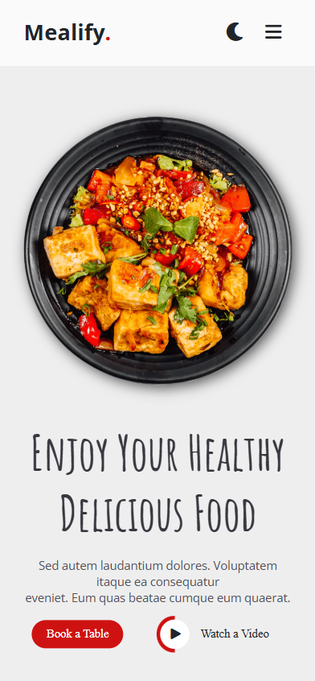

# Mealify 🍽️

A responsive restaurant website built using HTML & CSS.

## 🚀 Live Demo
https://esraasayed8.github.io/Mealify/

## 📸 Screenshots

### Desktop View

### Mobile View

## 🛠️ Technologies Used
- HTML5
- CSS3
- Font Awesome

## ✨ Features
- Fully responsive layout
- Clean and modern UI
- Semantic HTML structure
- Mobile-first approach

## 📂 Project Structure
Mealify/
├─ index.html
├─ css/
├─ imgs/
└─ fontawesome/

## 👩‍💻 Author
Esraa Sayed
